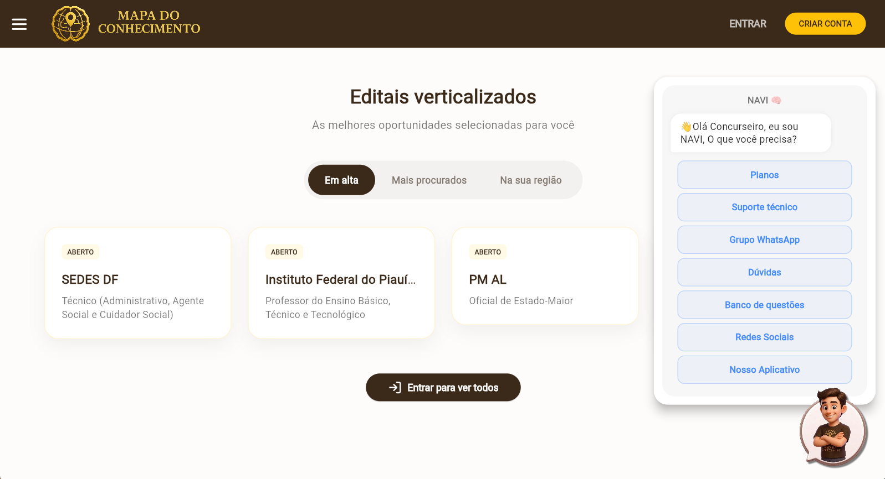

# 🤖 NAVI - Chatbot Inteligente de Navegação

  

## 📌 Visão Geral

Implementação do **NAVI**, chatbot inteligente de suporte e navegação dentro do Mapa do Conhecimento (app e web).

A proposta foi substituir o modelo tradicional de FAQ estático por uma experiência conversacional guiada dentro do sistema.

---

## 🚀 O que foi implementado

- ✔ Chatbot interno estilo assistente de suporte (NAVI)
- ✔ Fluxo de conversa 100% estruturado (sem IA, baseado em lógica programada)
- ✔ Navegação direta para áreas do sistema (planos, suporte, dúvidas)
- ✔ Respostas contextuais baseadas nas escolhas do usuário
- ✔ Integração com links externos (WhatsApp e comunidades)
- ✔ Interface flutuante integrada ao app com experiência contínua

---

## ⚙️ Arquitetura técnica

A implementação foi baseada em uma estrutura simples, modular e escalável:

- **ChatService** → controle de fluxo e regras de navegação
- **ChatWidget** → renderização da interface e interação com usuário
- Sistema de opções baseado em **estados e transições de conversa**

---

## 🧠 Impacto no produto

Na prática, o NAVI reduz a fricção de navegação dentro da plataforma:

- Usuário não precisa procurar informações manualmente  
- O sistema guia o usuário até o destino desejado em poucos cliques  
- Melhora experiência de onboarding e suporte  
- Aumenta conversão dentro da plataforma  

---

## 💡 Resultado

O NAVI transforma o sistema em uma experiência mais fluida e interativa, mantendo performance leve, previsível e escalável sem dependência de IA externa.
